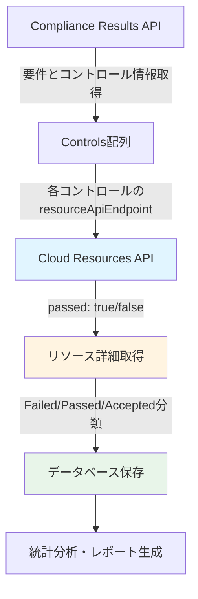

# Sysdig CSPM API統合ガイド

## 概要

Sysdig CSPMのコンプライアンス評価は、2つの主要なAPIを使用して実現されます：
1. **Compliance Results API** - コンプライアンス要件とコントロールの評価結果を取得
2. **Cloud Resources API** - 各コントロールに紐づくリソースの詳細情報（passed/failed/accepted）を取得

## 新しいAPI連携フロー（v2.0）



### データフロー詳細

```
1. Compliance Results API
   └─> Requirements (要件)
       └─> Controls (コントロール)
           ├─> objectsCount (failed数)
           ├─> passingCount (passed数)
           ├─> acceptedCount (accepted数)
           └─> resourceApiEndpoint (リソース取得URL)

2. Cloud Resources API (各コントロールごとに実行)
   └─> Resources
       ├─> passed: false (違反リソース)
       ├─> passed: true (合格リソース)
       └─> acceptance != null (受容済みリソース)

3. Database
   ├─> compliance_requirements (要件・コントロール情報)
   ├─> cloud_resources (リソース詳細)
   └─> control_resource_relations (コントロール×リソースの紐付け)

4. Analysis & Reporting
   ├─> Failed/Passed/Accepted統計
   ├─> コントロール別分析
   └─> アカウント/リージョン別分析
```

## 1. Compliance Results API

### エンドポイント
```
GET https://us2.app.sysdig.com/api/cspm/v1/compliance/requirements
```

### 主要パラメータ
- `filter`: コンプライアンス要件のフィルタ条件
- `pageNumber`: ページ番号（デフォルト: 1）
- `pageSize`: ページサイズ（デフォルト: 10、最大: 50）

### よく使用するフィルタ例

#### すべての違反を取得（Failed + Accepted含む）
```
filter=pass = "false" and policy.name contains "CIS Amazon" and zone.name in ("Entire Infrastructure")
```

#### プラットフォーム指定
```
filter=pass = "false" and policy.name contains "CIS Amazon" and platform = "AWS"
```

### レスポンス構造（重要フィールド）

```json
{
  "data": [
    {
      "name": "2.1.2 Ensure MFA Delete is enabled on S3 buckets",
      "requirementId": "16023",
      "policyId": "15",
      "policyName": "CIS Amazon Web Services Foundations Benchmark v3.0.0",
      "pass": false,
      "severity": "High",
      "failedControls": 2,
      "controls": [
        {
          "id": "16027",
          "name": "S3 - Enabled MFA Delete",
          "description": "Adding MFA delete to an S3 bucket...",
          "pass": false,
          "severity": "High",
          "objectsCount": 138,
          "acceptedCount": 118,
          "passingCount": 0,
          "resourceKind": "AWS_S3_VERSIONING_CONFIGURATION",
          "resourceApiEndpoint": "/api/cspm/v1/cloud/resources?controlId=16027&providerType=AWS&resourceKind=AWS_S3_VERSIONING_CONFIGURATION&filter=policyId=15 and zones.id=13010272"
        },
        {
          "id": "16026",
          "name": "S3 - Enabled Versioning",
          "objectsCount": 36,
          "acceptedCount": 0,
          "passingCount": 220,
          "resourceKind": "AWS_S3_BUCKET",
          "resourceApiEndpoint": "/api/cspm/v1/cloud/resources?controlId=16026&providerType=AWS&resourceKind=AWS_S3_BUCKET&filter=policyId=15 and zones.id=13010272"
        }
      ]
    }
  ],
  "totalCount": 40
}
```

### 重要フィールドの意味

| フィールド | 説明 |
|-----------|------|
| `controls[].objectsCount` | **Failed状態のリソース数**（passed: false） |
| `controls[].passingCount` | **Passed状態のリソース数**（passed: true） |
| `controls[].acceptedCount` | **Risk Acceptance済みのリソース数**（acceptance != null） |
| `controls[].resourceApiEndpoint` | **そのコントロールのリソースを取得するAPI URL** |

**注意**: `objectsCount`にはacceptedCountが含まれる場合があります。
- 実際のfailed数 = `objectsCount - acceptedCount`（未受容の違反）

## 2. Cloud Resources API（新規利用）

### エンドポイント
```
GET https://us2.app.sysdig.com/api/cspm/v1/cloud/resources
```

詳細は [Cloud Resources API](./Cloud%20Resources%20API.md) を参照

### Compliance Results APIとの連携

#### Step 1: Compliance Resultsから`resourceApiEndpoint`を取得

```json
{
  "controls": [
    {
      "id": "16027",
      "name": "S3 - Enabled MFA Delete",
      "resourceApiEndpoint": "/api/cspm/v1/cloud/resources?controlId=16027&providerType=AWS&resourceKind=AWS_S3_VERSIONING_CONFIGURATION&filter=policyId=15 and zones.id=13010272"
    }
  ]
}
```

#### Step 2: Cloud Resources APIでリソース取得

```bash
curl -X GET "https://us2.app.sysdig.com/api/cspm/v1/cloud/resources?controlId=16027&providerType=AWS&resourceKind=AWS_S3_VERSIONING_CONFIGURATION&filter=policyId=15%20and%20zones.id=13010272&pageSize=50" \
  -H "Authorization: Bearer ${SYSDIG_API_TOKEN}" \
  -H "Content-Type: application/json"
```

#### Step 3: レスポンスからFailed/Passed/Acceptedを分類

```json
{
  "data": [
    {
      "name": "my-bucket - Versioning",
      "passed": false,
      "hash": "912d0a04113fe91d",
      "type": "S3 Versioning Configuration",
      "account": "prod-account",
      "location": "ap-northeast-1",
      "acceptance": null
    },
    {
      "name": "accepted-bucket - Versioning",
      "passed": false,
      "hash": "abc123def456",
      "acceptance": {
        "justification": "Business requirement",
        "expirationDate": "2025-12-31"
      }
    },
    {
      "name": "compliant-bucket - Versioning",
      "passed": true,
      "hash": "xyz789ghi012",
      "acceptance": null
    }
  ],
  "totalCount": 256
}
```

**リソース分類ロジック**:
```
if (acceptance != null) {
    status = "Accepted"  // Risk Acceptance済み
} else if (passed == false) {
    status = "Failed"    // 違反（未受容）
} else if (passed == true) {
    status = "Passed"    // 合格
}
```

## 3. 統合実装フロー

### 推奨データ収集フロー

```
1. Compliance Results APIを実行
   ↓
2. 各Requirementをイテレート
   ↓
3. 各Controlをイテレート
   ↓
4. resourceApiEndpointを使用してCloud Resources APIを実行
   ↓
5. 取得したリソースをFailed/Passed/Acceptedに分類
   ↓
6. データベースに保存
   - compliance_requirements テーブル
   - cloud_resources テーブル
   - control_resource_relations テーブル
```

### Go言語実装サンプル

```go
type ComplianceCollector struct {
    client *CSPMClient
    db     *Database
}

// CollectComplianceData collects compliance requirements and associated resources
func (cc *ComplianceCollector) CollectComplianceData(policyFilter string) error {
    // Step 1: Get compliance requirements
    fmt.Println("Step 1: Getting compliance requirements...")
    complianceResp, err := cc.client.GetAllComplianceRequirements(policyFilter, 50, 3, 1)
    if err != nil {
        return fmt.Errorf("failed to get compliance requirements: %w", err)
    }

    // Save requirements to DB
    if err := cc.db.SaveComplianceRequirements(complianceResp.Data); err != nil {
        return fmt.Errorf("failed to save compliance requirements: %w", err)
    }

    // Step 2: Get resources for each control
    fmt.Println("Step 2: Getting resources for each control...")
    totalControls := 0
    totalResources := 0

    for _, req := range complianceResp.Data {
        if req.Pass {
            continue // Skip passed requirements
        }

        for _, ctrl := range req.Controls {
            totalControls++

            // Parse resourceApiEndpoint
            endpoint := ctrl.ResourceApiEndpoint

            // Get resources for this control
            resources, err := cc.client.GetAllCloudResources(endpoint, 50, 3, 1)
            if err != nil {
                fmt.Printf("[WARN] Failed to get resources for control %s: %v\n", ctrl.ID, err)
                continue
            }

            // Classify resources by status
            var failed, passed, accepted int
            for _, res := range resources.Data {
                if res.Acceptance != nil {
                    accepted++
                } else if !res.Passed {
                    failed++
                } else {
                    passed++
                }
            }

            fmt.Printf("  Control %s: %d total (Failed: %d, Passed: %d, Accepted: %d)\n",
                ctrl.Name, len(resources.Data), failed, passed, accepted)

            // Save resources to DB
            if err := cc.db.SaveCloudResources(resources.Data, ctrl.ID); err != nil {
                return fmt.Errorf("failed to save resources: %w", err)
            }

            totalResources += len(resources.Data)
        }
    }

    fmt.Printf("\nTotal: %d controls, %d resources collected\n", totalControls, totalResources)
    return nil
}
```

## 4. データベース設計

### テーブル構造

#### compliance_requirements テーブル
```sql
CREATE TABLE compliance_requirements (
    id INTEGER PRIMARY KEY AUTOINCREMENT,
    requirement_id TEXT NOT NULL,
    name TEXT NOT NULL,
    policy_id TEXT NOT NULL,
    policy_name TEXT NOT NULL,
    platform TEXT,
    severity TEXT NOT NULL,
    pass BOOLEAN NOT NULL,
    failed_controls INTEGER DEFAULT 0,
    description TEXT,
    created_at TIMESTAMP DEFAULT CURRENT_TIMESTAMP,
    UNIQUE(requirement_id, policy_id)
);
```

#### controls テーブル（新規）
```sql
CREATE TABLE controls (
    id INTEGER PRIMARY KEY AUTOINCREMENT,
    control_id TEXT NOT NULL UNIQUE,
    name TEXT NOT NULL,
    description TEXT,
    requirement_id TEXT NOT NULL,
    severity TEXT NOT NULL,
    pass BOOLEAN NOT NULL,
    objects_count INTEGER DEFAULT 0,      -- Failed数
    passing_count INTEGER DEFAULT 0,      -- Passed数
    accepted_count INTEGER DEFAULT 0,     -- Accepted数
    resource_kind TEXT,
    resource_api_endpoint TEXT,
    created_at TIMESTAMP DEFAULT CURRENT_TIMESTAMP,
    FOREIGN KEY (requirement_id) REFERENCES compliance_requirements(requirement_id)
);

CREATE INDEX idx_ctrl_requirement ON controls(requirement_id);
CREATE INDEX idx_ctrl_id ON controls(control_id);
```

#### cloud_resources テーブル（新規）
```sql
CREATE TABLE cloud_resources (
    id INTEGER PRIMARY KEY AUTOINCREMENT,
    hash TEXT NOT NULL UNIQUE,
    name TEXT NOT NULL,
    type TEXT NOT NULL,
    platform TEXT NOT NULL,
    account TEXT,
    location TEXT,
    organization TEXT,

    -- Pass/Fail/Accepted状態
    passed BOOLEAN NOT NULL,              -- そのコントロールでのpass/fail
    acceptance_status TEXT,                -- 'failed', 'passed', 'accepted'
    acceptance_justification TEXT,         -- Risk Acceptance理由
    acceptance_expiration_date TEXT,       -- 受容期限

    -- メタデータ
    zones_json TEXT,
    last_seen_date TEXT,

    created_at TIMESTAMP DEFAULT CURRENT_TIMESTAMP,
    updated_at TIMESTAMP DEFAULT CURRENT_TIMESTAMP
);

CREATE INDEX idx_cloud_res_hash ON cloud_resources(hash);
CREATE INDEX idx_cloud_res_type ON cloud_resources(type);
CREATE INDEX idx_cloud_res_account ON cloud_resources(account);
CREATE INDEX idx_cloud_res_acceptance ON cloud_resources(acceptance_status);
```

#### control_resource_relations テーブル（新規）
```sql
CREATE TABLE control_resource_relations (
    id INTEGER PRIMARY KEY AUTOINCREMENT,
    control_id TEXT NOT NULL,
    resource_hash TEXT NOT NULL,
    passed BOOLEAN NOT NULL,
    acceptance_status TEXT NOT NULL,  -- 'failed', 'passed', 'accepted'
    created_at TIMESTAMP DEFAULT CURRENT_TIMESTAMP,

    FOREIGN KEY (control_id) REFERENCES controls(control_id),
    FOREIGN KEY (resource_hash) REFERENCES cloud_resources(hash),
    UNIQUE(control_id, resource_hash)
);

CREATE INDEX idx_rel_control ON control_resource_relations(control_id);
CREATE INDEX idx_rel_resource ON control_resource_relations(resource_hash);
CREATE INDEX idx_rel_status ON control_resource_relations(acceptance_status);
```

## 5. 統計分析クエリ例

### コントロール別の統計
```sql
SELECT
    c.control_id,
    c.name as control_name,
    c.severity,
    COUNT(CASE WHEN r.acceptance_status = 'failed' THEN 1 END) as failed_count,
    COUNT(CASE WHEN r.acceptance_status = 'passed' THEN 1 END) as passed_count,
    COUNT(CASE WHEN r.acceptance_status = 'accepted' THEN 1 END) as accepted_count,
    COUNT(*) as total_resources
FROM controls c
LEFT JOIN control_resource_relations r ON c.control_id = r.control_id
GROUP BY c.control_id, c.name, c.severity
ORDER BY failed_count DESC;
```

### アカウント別の違反統計
```sql
SELECT
    cr.account,
    COUNT(CASE WHEN rel.acceptance_status = 'failed' THEN 1 END) as failed_count,
    COUNT(CASE WHEN rel.acceptance_status = 'accepted' THEN 1 END) as accepted_count,
    COUNT(CASE WHEN rel.acceptance_status = 'passed' THEN 1 END) as passed_count
FROM cloud_resources cr
JOIN control_resource_relations rel ON cr.hash = rel.resource_hash
GROUP BY cr.account
ORDER BY failed_count DESC;
```

### 重要度別の統計
```sql
SELECT
    c.severity,
    COUNT(DISTINCT c.control_id) as control_count,
    SUM(CASE WHEN rel.acceptance_status = 'failed' THEN 1 ELSE 0 END) as total_failed,
    SUM(CASE WHEN rel.acceptance_status = 'accepted' THEN 1 ELSE 0 END) as total_accepted,
    SUM(CASE WHEN rel.acceptance_status = 'passed' THEN 1 ELSE 0 END) as total_passed
FROM controls c
LEFT JOIN control_resource_relations rel ON c.control_id = rel.control_id
GROUP BY c.severity
ORDER BY
    CASE c.severity
        WHEN 'High' THEN 1
        WHEN 'Medium' THEN 2
        ELSE 3
    END;
```

### 特定コントロールのリソース一覧（Failed/Passed/Accepted別）
```sql
-- Failedリソース
SELECT cr.name, cr.account, cr.location, cr.type
FROM cloud_resources cr
JOIN control_resource_relations rel ON cr.hash = rel.resource_hash
WHERE rel.control_id = '16027'
  AND rel.acceptance_status = 'failed'
ORDER BY cr.account, cr.name;

-- Acceptedリソース
SELECT
    cr.name,
    cr.account,
    cr.location,
    cr.acceptance_justification,
    cr.acceptance_expiration_date
FROM cloud_resources cr
JOIN control_resource_relations rel ON cr.hash = rel.resource_hash
WHERE rel.control_id = '16027'
  AND rel.acceptance_status = 'accepted'
ORDER BY cr.acceptance_expiration_date;

-- Passedリソース
SELECT cr.name, cr.account, cr.location, cr.type
FROM cloud_resources cr
JOIN control_resource_relations rel ON cr.hash = rel.resource_hash
WHERE rel.control_id = '16027'
  AND rel.acceptance_status = 'passed'
ORDER BY cr.account, cr.name;
```

## 6. レポート生成例

### Executive Summary
```sql
-- 全体サマリー
SELECT
    COUNT(DISTINCT cr.requirement_id) as total_requirements,
    COUNT(DISTINCT c.control_id) as total_controls,
    COUNT(DISTINCT res.hash) as total_resources,
    SUM(CASE WHEN rel.acceptance_status = 'failed' THEN 1 ELSE 0 END) as failed_resources,
    SUM(CASE WHEN rel.acceptance_status = 'accepted' THEN 1 ELSE 0 END) as accepted_resources,
    SUM(CASE WHEN rel.acceptance_status = 'passed' THEN 1 ELSE 0 END) as passed_resources
FROM compliance_requirements cr
JOIN controls c ON cr.requirement_id = c.requirement_id
LEFT JOIN control_resource_relations rel ON c.control_id = rel.control_id
LEFT JOIN cloud_resources res ON rel.resource_hash = res.hash;
```

### Top 10 違反コントロール
```sql
SELECT
    c.name as control_name,
    c.severity,
    COUNT(CASE WHEN rel.acceptance_status = 'failed' THEN 1 END) as failed_count,
    COUNT(CASE WHEN rel.acceptance_status = 'accepted' THEN 1 END) as accepted_count
FROM controls c
LEFT JOIN control_resource_relations rel ON c.control_id = rel.control_id
WHERE c.pass = 0
GROUP BY c.control_id, c.name, c.severity
ORDER BY failed_count DESC
LIMIT 10;
```

## 7. ベストプラクティス

### データ収集
1. **段階的な取得**: Compliance Results → 各Control → Resources
2. **並列処理**: コントロール別のリソース取得を並列化（推奨: 3-5並列）
3. **エラーハンドリング**: 一部のコントロールが失敗しても継続
4. **進捗表示**: 長時間処理のため進捗を表示

### データベース管理
1. **リレーション管理**: 中間テーブル（control_resource_relations）で多対多を管理
2. **インデックス**: 頻繁に使用するフィールドにインデックス作成
3. **更新戦略**: 差分更新ではなく、新規DB作成を推奨（タイムスタンプでバージョン管理）

### パフォーマンス最適化
1. **バッチサイズ**: pageSize=50を推奨
2. **API遅延**: バッチ間に1-3秒の遅延を設定
3. **キャッシュ**: 頻繁にアクセスするデータはメモリキャッシュ

### Risk Acceptance対応
1. **将来の実装**: `acceptance`フィールドを活用してRisk Acceptance機能を実装予定
2. **ステータス管理**: failed/passed/acceptedの3状態を明確に区別
3. **期限管理**: `acceptance_expiration_date`で受容期限を管理

## 8. トラブルシューティング

### リソースが取得できない場合
1. `resourceApiEndpoint`が正しく抽出されているか確認
2. URLパラメータが正しくエンコードされているか確認
3. controlIdとresourceKindの組み合わせが有効か確認

### データ不整合の対処
1. Compliance APIとCloud Resources APIの統計値が一致しない場合がある
   - API側の仕様（totalCountは概算値の場合あり）
   - 実際に取得できたデータ数を信頼
2. acceptedCountの扱い
   - objectsCountにacceptedCountが含まれる場合がある
   - 実際のリソースデータで判断

## 9. 関連ドキュメント

- [Compliance Results API](./Compliance%20Results.md)
- [Cloud Resources API](./Cloud%20Resources%20API.md)
- [Resource API Endpoint Analysis](../design/resource-api-endpoint-analysis.md)
- [SQLite Schema Design](../design/sqlite-schema-design.md)
